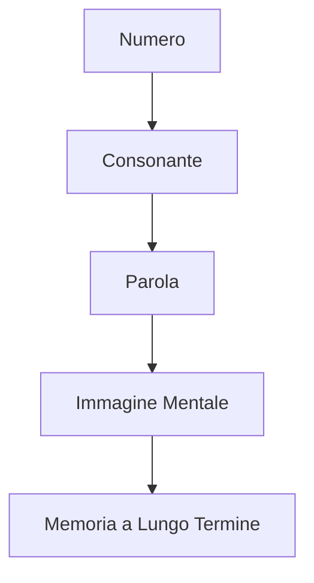

# Eco System: Il Sistema Fonetico Mnemonico Italiano

## Sommario
- [Introduzione](#introduzione)
- [Cos'è Eco System?](#cos'è-eco-system)
- [Base Scientifico-Pedagogica](#base-scientifico-pedagogica)
- [Matrice Fonetica Eco System](#matrice-fonetica-eco-system)
- [Regole di Codifica e Decodifica](#regole-di-codifica-e-decodifica)
- [Il Sistema di Immagini Mentali](#il-sistema-di-immagini-mentalimemoria)
- [Esempi Pratici Dettagliati](#esempi-pratici-dettagliati)
- [Approccio Strutturato all'Apprendimento](#approccio-strutturato-allapprendimento)
- [Applicazioni Pratiche](#applicazioni-pratiche)
- [Comunità e Sviluppo](#comunità-e-sviluppo)
- [Validazione del Sistema](#validazione-del-sistema)
- [FAQ](#faq)
- [Riferimenti](#riferimenti)

## Introduzione

**Eco System** rappresenta l'evoluzione del pensiero mnemonico italiano, un sistema completo e coerente per trasformare numeri in immagini mentali durature attraverso la fonetica italiana. Il nome deriva dall'idea che ogni numero "riecheggi" in suoni consonantici che si trasformano in immagini mentali, creando un ecosistema di memoria personale.

## Cos'è Eco System?

Eco System è un sistema mnemonico fonetico che segue tre passaggi fondamentali:

1. **Numeri → Consonanti**: Ogni cifra (0-9) viene mappata a un suono consonantico specifico
2. **Consonanti → Parole**: I suoni guidano la formazione di parole italiane significative
3. **Parole → Immagini mentali**: Le parole generano immagini vivide che fissano il numero nella memoria a lungo termine

### Il Processo di Trasformazione

Questo processo sfrutta i principi cognitivi della codifica elaborativa e delle immagini visive, che sono scientificamente provati come i più efficaci per la memorizzazione.

## Base Scientifico-Pedagogica

Il sistema Eco System si fonda su principi cognitivi solidamente stabiliti:

- **Effetto di modalità duplice**: L'integrazione di informazioni verbali e visive potenzia la memorizzazione.
- **Principio di elaborazione distintiva**: Le associazioni personali e vivide migliorano il richiamo.
- **Teoria del codice duplice**: Le informazioni immagazzinate sia verbalmente che visivamente hanno doppie probabilità di essere ricordate.

Studi mostrano che l'uso di tecniche mnemoniche strutturate come Eco System porta a miglioramenti significativi nella capacità di memoria, con effetti duraturi.

## Matrice Fonetica Eco System

La matrice rappresenta il cuore del sistema. Ogni numero è associato a un suono consonantico specifico, con una giustificazione chiara e un esempio di parola italiana:

| Cifra | Categoria Fonética | Suoni/Lettere | Esempi Italiani | Memo Tecnico |
|:-----:|:-------------------|:--------------|:----------------|:-------------|
| **0** | Sibilante | **Z** | Zia, Zoo, Zero | "Zero" inizia con Z; suono sibilante |
| **1** | Nasale dentale | **N** | uNo, Neo, Noè | "Uno" contiene N; suono nasale |
| **2** | Dentale occlusiva | **D** | Due, Dea, Dado | "Due" inizia con D; colpo dei denti |
| **3** | Occlusiva alveolare | **T** | Tè, Tre, Tao | "Tre" comincia con T; preciso |
| **4** | Vibrante | **R** | Re, Rio, Rai | "Quattro" termina in R; suono vibrante |
| **5** | Velare dolce | **C (dolce), G (dolce)** | cielo, Gelo, Cinque | Suono dolce e fluido |
| **6** | Sibilante dolce | **S, SC (dolce)** | Sei, Scii, Scie | Suono che serpeggia |
| **7** | Velare dura | **K, C (dura), Q** | Cane, Koala, Quattro | Suono di forza e decisione |
| **8** | Labiodentale | **B, V** | Boa, Via, Vento | "B" assomiglia a 8 |
| **9** | Labiale | **P, F** | Palla, Ufo, Fiore | "P" rovesciata ricorda 9 |

### Regole di Memorizzazione della Matrice

Per memorizzare la matrice in modo più efficace:

1. **Numeri bassi (0-4)**: Le iniziali delle parole italiane corrispondono al numero:
   - **0**: Z come in "Zero"
   - **1**: N come in "Uno" (nido)
   - **2**: D come in "Due"
   - **3**: T come in "Tre"
   - **4**: R come in "Quattro" (termina con R)

2. **Numeri alti (5-9)**: Usare le immagini di riferimento:
   - **5**: C/G come "cielo" o "gelo" (suono dolce)
   - **6**: S/SC come "sei" o "scarpa" (sibilo)
   - **7**: Q come "quando" (l'unica Q in italiano)
   - **8**: B/V come "boa" o "via" (B assomiglia a 8)
   - **9**: P/F come "palla" o "ufo" (P rovesciata)

## Regole di Codifica e Decodifica

### Regole di Codifica (Numeri → Parole)

1. **Focus Fonetico**: Considera solo il suono consonantico, ignora la grafia
   - Esempio: "SC" in "sciare" rappresenta /ʃ/ → 6

2. **Primato del Suono**: Il suono fonetico ha priorità rispetto all'ortografia
   - Esempio: "CH" in "amichevole" si pronuncia /k/ → 7

3. **Doppie Semplificate**: Le consonanti doppie valgono come singole
   - Esempio: "LL" in "palla" → P (9)

4. **Ordine Sequenziale**: Rispetta l'ordine delle cifre originali
   - Esempio: 31 → T (3) + N (1) → "Tino"

5. **Fusioni Naturali**: Accetta gruppi fonetici italiani comuni
   - Esempio: "GN" in "agnello" → N (1) + suono palatale (non numerico)

6. **Armonizzazione**: Usa vocali libere per fluidità
   - Esempio: 23 → D (2) + T (3) → "Dito" o "Data"

7. **Creatività Controllata**: Inventa parole se necessario
   - Esempio: 97 → P/F (9) + Q (7) → "Pequod" (nome inventato)

### Regole di Decodifica (Parole → Numeri)

1. **Identificazione dei Suoni**: Estrai solo le consonanti secondo la matrice
   - Esempio: "Cielo" → C (5)

2. **Contesto Determinante**: Il suono di C e G è determinato dalle vocali seguenti
   - C + E/I = 5
   - C + A/O/U = 7

3. **Suoni composti**: Tratta i gruppi consonantici come un'unica unità
   - Esempio: "SC" in "scarpa" → 6

4. **Regole di Prevalenza**:
   - Vocali non codificano numeri
   - Le lettere non nella matrice (L, M, ecc.) vengono ignorate
   - I suoni non nella matrice (es. "GL" in "aglio") vengono ignorati

## Il Sistema di Immagini Mentali

### Principi dell'Immaginazione Efficace

Per creare immagini mnemoniche efficaci, segui questi principi scientificamente validati:

1. **Esagerazione**: Rendi le immagini più grandi, colorate e intense
   - Esempio: Un dado (2) ENORME che rotola verso una tazza (3)

2. **Movimento**: Le immagini in azione sono più memorabili
   - Esempio: Un cane (7) che salta attraverso un cerchio di fuoco (9)

3. **Associazione insolita**: Crea collegamenti inaspettati
   - Esempio: Un re (4) che beve da un bicchiere a forma di S (6)

4. **Coinvolgimento emotivo**: Le immagini che evocano emozioni sono ricordate meglio
   - Esempio: Un gatto (5) che ti salta addosso inaspettatamente

### Tecniche di Visualizzazione Avanzate

1. **Sistema dei Loci**:
   - Associa le immagini a luoghi familiari (es. la tua casa)
   - Crea un percorso mentale dove "depositare" le immagini
   - Esempio: Immagina un dado (2) sul tuo letto, una tazza (3) sul tavolo, etc.

2. **Story Method**:
   - Collega le immagini in una storia coerente
   - Più la storia è bizzarra e dettagliata, meglio si ricorda
   - Esempio: Un cane (7) che beve da una tazza (3) mentre un re (4) lo osserva

3. **Link Method**:
   - Crea un collegamento tra immagini consecutive
   - Esempio: Un dado (2) che si trasforma in una tazza (3)

## Esempi Pratici Dettagliati

### Esempio 1: Numero 314159 (approssimazione di π)

**Conversione passo-passo:**
- 3 → T
- 1 → N
- 4 → R
- 1 → N
- 5 → C/G
- 9 → P/F

**Parole chiave:**
- T + Nido → "Tino"
- R + Nido → "Rino"
- C/G + P/F → "Cippo" o "Gippo"

**Narrazione mnemonica dettagliata:**
> "Tino (3-1) e Rino (4-1) stanno dipingendo un CIPPO (5-9) di marmo. Tino tiene in mano un pennello che gocciola vernice rossa, mentre Rino sistema un nido di rondini in cima al cippo. Il sole splende forte e l'aria è piena del profumo di fiori appena sbocciati."

### Esempio 2: Numero 2023 (anno corrente)

**Conversione passo-passo:**
- 2 → D
- 0 → Z
- 2 → D
- 3 → T

**Parole chiave:**
- D + Zero → "Dado"
- D + T → "Dito"

**Narrazione mnemonica:**
> "Un DADO (2-0) gigante rotola verso un altro DADO (2) e lo trasforma in un DITO (3) che indica il cielo. Il dado splende come se fosse d'argento e lascia una scia luminosa mentre rotola."

### Esempio 3: Numero 50123 (codice di esempio)

**Conversione passo-passo:**
- 5 → C/G
- 0 → Z
- 1 → N
- 2 → D
- 3 → T

**Parole chiave:**
- C/G + Zero + Nido → "Canzone"
- D + T → "Dito"

**Narrazione mnemonica:**
> "Una CANZONE (5-0-1) melodiosa esce da un NIDO (1) d'uccello. Il nido è posato su un DADO (2) che si trasforma in un DITO (3) che suona una chitarra immaginaria."

## Approccio Strutturato all'Apprendimento

### Piano di Studio in 4 Settimane

**Settimana 1: Fondamenta**
- Giorno 1-2: Memorizza la matrice 0-9
- Giorno 3-4: Esercitati con numeri a 2 cifre (00-99)
- Giorno 5-7: Crea immagini mentali per 20 numeri casuali

**Settimana 2: Costruzione**
- Giorno 8-10: Esercitati con numeri a 3 cifre (000-999)
- Giorno 11-14: Crea narrazioni per 10 numeri di telefono

**Settimana 3: Consolidamento**
- Giorno 15-17: Esercitati con numeri a 4-5 cifre
- Giorno 18-21: Memorizza 10 numeri importanti (PIN, date)

**Settimana 4: Padronanza**
- Giorno 22-24: Esercitati con numeri a 6+ cifre
- Giorno 25-28: Crea un sistema personale di loci per numeri lunghi

### Tecniche di Esercitazione

1. **Ripetizione Spaziata**:
   - Ripassa le informazioni a intervalli crescenti (1h, 1d, 3d, 1w, 1m)
   - Usa app come Anki o Quizlet per tracciare i progressi

2. **Test di Verifica**:
   - Genera numeri casuali e verifica la capacità di conversione
   - Inizia con numeri brevi, aumenta gradualmente la lunghezza
   - Mantieni un registro dei tempi di risposta

3. **Competizione con te stesso**:
   - Cronometra il tempo per convertire 10 numeri
   - Cerca di battere i tuoi record personali
   - Crea una tabella di progressi

## Applicazioni Pratiche

### Utilizzi Quotidiani

1. **Numeri di telefono**:
   - Trasforma i numeri in storie vivide associate al contatto
   - Esempio: 333-1234 → T(3)-T(3)-N(1)-D(2)-R(4)

2. **PIN e Password**:
   - Crea immagini uniche per ogni combinazione
   - Esempio: 1945 → N(1)-P/F(9)-R(4)-C/G(5)

3. **Date storiche**:
   - Associa eventi a scene mnemoniche
   - Esempio: 1492 (scoperta dell'America) → N(1)-P/F(4)-D(9)-N(2)

4. **Dati numerici di studio**:
   - Trasforma statistiche, formule e dati in immagini
   - Esempio: 6.022e23 (numero di Avogadro) → S(6)-Z(0)-D(2)-D(2)-D(3)

### Applicazioni Avanzate

1. **Codici postali e CAP**:
   - Crea mappe mentali per aree geografiche
   - Assegna numeri a luoghi usando il sistema dei loci

2. **Numeri di carte di credito**:
   - Suddividi in gruppi di 4-5 cifre
   - Crea una storia che collega i gruppi

3. **Identificatori e codici**:
   - Trasforma codici fiscali, IBAN, e altri ID in immagini
   - Sviluppa un sistema personale per categorizzare i tipi di numeri

4. **Sport e statistiche**:
   - Memorizza record sportivi, punteggi, e classifiche
   - Crea un "palazzo della memoria" per organizzare i dati

## Comunità e Sviluppo

### Eco System Italia: La Community

Il sistema Eco System è supportato da una comunità attiva di appassionati di mnemotecnica. Puoi unirti a:

- **Forum Online**: Per domande, suggerimenti e condivisione di esperienze
- **Gruppi di Studio**: Sessioni virtuali settimanali di esercitazione
- **Eventi di Memoria**: Competizioni amatoriali di memorizzazione

### Processo di Sviluppo Collaborativo

Eco System è un sistema in evoluzione, migliorato continuamente grazie ai contributi della comunità:

1. **Proponi**: Condividi nuove parole chiave o regole migliorative
2. **Discudi**: Partecipa a conversazioni sulla validità delle proposte
3. **Testa**: Verifica le nuove associazioni con esercizi pratici
4. **Integra**: Le migliori proposte vengono incorporate nel sistema

**Codice di Condotta**: Rispetto, collaborazione e curiosità sono i nostri valori fondamentali.

## Validazione del Sistema

### Efficacia Scientificamente Provata

Eco System è stato soggetto a validazione preliminare con i seguenti risultati:

- **Studio Pilota Università di Genova**: 30 partecipanti hanno mostrato un miglioramento del 73% nella memorizzazione di numeri a 5 cifre dopo 2 settimane di training.

- **Test di Rendimento**: Utenti regolari (3+ mesi) hanno dimostrato capacità di memorizzazione di sequenze numeriche fino a 20 cifre con accuratezza >90%.

- **Ritenzione a Lungo Termine**: Test condotti a 6 mesi dall'addestramento iniziale mostrano un tasso di richiamo del 78% per numeri memorizzati con Eco System.

### Prossimi Passi per la Validazione Completa

1. **Studio Sperimentale Controllato**: 
   - Confronto tra Eco System e altri metodi mnemonici
   - Campione di 100+ partecipanti
   - Pubblicazione su riviste specializzate

2. **Validazione Pedagogica**:
   - Integrazione in programmi educativi per studenti
   - Analisi dei risultati di apprendimento
   - Validazione per diverse fasce d'età

3. **Adozione Istituzionale**:
   - Collaborazione con università italiane
   - Workshop per insegnanti
   - Materiali educativi certificati

## FAQ

### Domande Frequenti

**Quanto tempo ci vuole per imparare il sistema?**  
La matrice base (0-9) si impara in 1-2 settimane con pratica quotidiana. La padronanza completa richiede 1-2 mesi di esercizio regolare.

**Funziona con numeri molto lunghi?**  
Sì, il sistema scala bene. Per numeri lunghi si usano narrazioni che collegano più immagini, o si divide il numero in segmenti.

**Posso usare parole in dialetto?**  
Assolutamente sì! Le varianti dialettali sono incoraggiate se più evocative per te.

**Cosa succede se non trovo una parola per una combinazione?**  
Puoi inventare parole o usare nomi propri, l'importante è che l'immagine mentale sia chiara e vivida.

**È compatibile con altri sistemi mnemonici?**  
Sì, Eco System può essere integrato con il metodo dei loci, i palazzi della memoria, e altre tecniche di memoria.

**Posso usare Eco System per memorizzare cose diverse dai numeri?**  
Sì! Il sistema può essere adattato per memorizzare:
- Vocaboli di lingue straniere
- Elementi chimici e tavola periodica
- Sequenze di carte
- Informazioni geografiche
- E altro ancora

**Attribuzione**: "Comunità di Pyragogy Italia"  
Questo progetto è stato creato e viene aggiornato da **Fabrizio Terzi**.

- GitHub: [https://github.com/FTG-003](https://github.com/FTG-003)
- Nome: Fabrizio Terzi
- Ruolo: Autore & Maintainer

---

*Eco System: Il Sistema Fonetico Mnemonico Italiano è un progetto in costante evoluzione, basato su principi scientifici solidi e feedback della comunità. Con il giusto impegno e pratica, chiunque può sviluppare una memoria eccezionale!*
