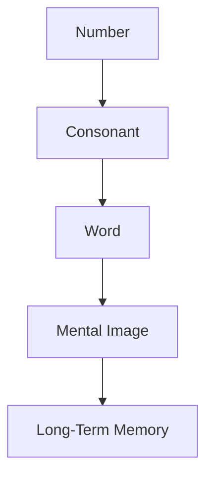

# Eco System: The Italian Phonetic Mnemonic System

## Table of Contents
- [Introduction](#introduction)
- [What is Eco System?](#what-is-eco-system)
- [Scientific-Pedagogical Basis](#scientific-pedagogical-basis)
- [Eco System Phonetic Matrix](#eco-system-phonetic-matrix)
- [Encoding and Decoding Rules](#encoding-and-decoding-rules)
- [The Mental Imagery System](#the-mental-imagery-system)
- [Detailed Practical Examples](#detailed-practical-examples)
- [Structured Learning Approach](#structured-learning-approach)
- [Practical Applications](#practical-applications)
- [Community and Development](#community-and-development)
- [System Validation](#system-validation)
- [FAQ](#faq)
- [References](#references)

[Leggi questo in Italiano](README.md)

## Introduction

**Eco System** is a phonetic-mnemonic system, designed for the Italian language and inspired by the classic *Major System*. It transforms numerical sequences into **vivid mental images** through a mapping of consonant sounds.
The result is a natural, intuitive, and lasting method to enhance memory and association skills.

The name **Eco System** comes from the idea that each number produces a phonetic "echo" that returns as an image, creating a true **ecosystem of the mind**, where sound, word, and imagination feed each other.

> "It's not just a memory technique, but a language that transforms numbers into images and images into thought."

## What is Eco System?

Eco System is a phonetic mnemonic system that follows three fundamental steps:

1.  **Numbers → Consonants**: Each digit (0-9) is mapped to a specific consonant sound.
2.  **Consonants → Words**: The sounds guide the formation of meaningful Italian words.
3.  **Words → Mental Images**: The words generate vivid images that fix the number in long-term memory.

### The Transformation Process

This process leverages the cognitive principles of elaborative encoding and visual imagery, which are scientifically proven to be the most effective for memorization.

## Scientific-Pedagogical Basis

The Eco System is based on solidly established cognitive principles:

- **Dual-Coding Effect**: Integrating verbal and visual information enhances memorization.
- **Distinctiveness Principle**: Personal and vivid associations improve recall.
- **Dual-Coding Theory**: Information stored both verbally and visually has double the chance of being remembered.

Studies show that using structured mnemonic techniques like Eco System leads to significant improvements in memory capacity, with lasting effects.

## Eco System Phonetic Matrix

The matrix is the heart of the system. Each number is associated with a specific consonant sound, with a clear justification and an example of an Italian word:

| Digit | Phonetic Category | Sounds/Letters | Italian Examples | Mnemonic Aid |
|:-----:|:------------------|:---------------|:-----------------|:---------------|
| **0** | Sibilant | **Z** | Zia, Zoo, Zero | "Zero" starts with Z; hissing sound |
| **1** | Dental Nasal | **N** | uNo, Neo, Noè | "Uno" contains N; nasal sound |
| **2** | Voiced Dental Stop | **D** | Due, Dea, Dado | "Due" starts with D; tap of the teeth |
| **3** | Alveolar Stop | **T** | Tè, Tre, Tao | "Tre" starts with T; precise |
| **4** | Vibrant | **R** | Re, Rio, Rai | "Quattro" ends in R; vibrating sound |
| **5** | Soft | **C (soft), G (soft)** | cielo, Gelo, Cinque | Soft and fluid sound |
| **6** | Soft Sibilant | **S, SC (soft)** | Sei, Scii, Scie | A sound that snakes |
| **7** | Hard | **K, C (hard), Q** | Cane, Koala, Quattro | Sound of strength and decision |
| **8** | Labiodental | **B, V** | Boa, Via, Vento | "B" looks like 8 |
| **9** | Labial | **P, F** | Palla, Ufo, Fiore | An inverted "P" resembles 9 |

### Rules for Memorizing the Matrix

To memorize the matrix more effectively:

1.  **Low numbers (0-4)**: The initials of the corresponding Italian words match the number:
    - **0**: Z as in "Zero"
    - **1**: N as in "Uno" (nido - nest)
    - **2**: D as in "Due"
    - **3**: T as in "Tre"
    - **4**: R as in "Quattro" (ends with R)

2.  **High numbers (5-9)**: Use reference images:
    - **5**: C/G like "cielo" (sky) or "gelo" (frost) (soft sound)
    - **6**: S/SC like "sei" (six) or "scarpa" (shoe) (hiss)
    - **7**: Q like "quando" (when) (the only Q in Italian)
    - **8**: B/V like "boa" or "via" (road) (B looks like 8)
    - **9**: P/F like "palla" (ball) or "ufo" (inverted P)

## Encoding and Decoding Rules

### Encoding Rules (Numbers → Words)

1.  **Phonetic Focus**: Consider only the consonant sound, ignore the spelling.
    - Example: "SC" in "sciare" represents /ʃ/ → 6

2.  **Sound Primacy**: The phonetic sound takes priority over spelling.
    - Example: "CH" in "amichevole" is pronounced /k/ → 7

3.  **Doubles Simplified**: Double consonants count as single ones.
    - Example: "LL" in "palla" → P (9)

4.  **Sequential Order**: Respect the order of the original digits.
    - Example: 31 → T (3) + N (1) → "Tino"

5.  **Natural Fusions**: Accept common Italian phonetic groups.
    - Example: "GN" in "agnello" → N (1) + palatal sound (non-numeric)

6.  **Harmonization**: Use free vowels for fluency.
    - Example: 23 → D (2) + T (3) → "Dito" (finger) or "Data" (date)

7.  **Controlled Creativity**: Invent words if necessary.
    - Example: 97 → P/F (9) + Q (7) → "Pequod" (invented name)

### Decoding Rules (Words → Numbers)

1.  **Sound Identification**: Extract only the consonants according to the matrix.
    - Example: "Cielo" → C (5)

2.  **Context is Key**: The sound of C and G is determined by the following vowels.
    - C + E/I = 5
    - C + A/O/U = 7

3.  **Compound Sounds**: Treat consonant groups as a single unit.
    - Example: "SC" in "scarpa" → 6

4.  **Precedence Rules**:
    - Vowels do not encode numbers.
    - Letters not in the matrix (L, M, etc.) are ignored.
    - Sounds not in the matrix (e.g., "GL" in "aglio") are ignored.

## The Mental Imagery System

### Principles of Effective Imagination

To create effective mnemonic images, follow these scientifically validated principles:

1.  **Exaggeration**: Make the images bigger, more colorful, and more intense.
    - Example: A HUGE die (2) rolling towards a cup (3).

2.  **Movement**: Images in action are more memorable.
    - Example: A dog (7) jumping through a ring of fire (9).

3.  **Unusual Association**: Create unexpected connections.
    - Example: A king (4) drinking from an S-shaped glass (6).

4.  **Emotional Involvement**: Images that evoke emotions are better remembered.
    - Example: A cat (5) unexpectedly jumping on you.

### Advanced Visualization Techniques

1.  **Method of Loci**:
    - Associate images with familiar places (e.g., your house).
    - Create a mental path where you "deposit" the images.
    - Example: Imagine a die (2) on your bed, a cup (3) on the table, etc.

2.  **Story Method**:
    - Link the images into a coherent story.
    - The more bizarre and detailed the story, the better it is remembered.
    - Example: A dog (7) drinking from a cup (3) while a king (4) watches.

3.  **Link Method**:
    - Create a link between consecutive images.
    - Example: A die (2) transforming into a cup (3).

## Detailed Practical Examples

### Example 1: Number 314159 (approximation of π)

**Step-by-step conversion:**
- 3 → T
- 1 → N
- 4 → R
- 1 → N
- 5 → C/G
- 9 → P/F

**Keywords:**
- T + Nido → "Tino"
- R + Nido → "Rino"
- C/G + P/F → "Cippo" or "Gippo" (milestone)

**Detailed mnemonic narrative:**
> "Tino (3-1) and Rino (4-1) are painting a marble CIPPO (5-9). Tino is holding a brush dripping with red paint, while Rino is placing a swallow's nest on top of the milestone. The sun is shining brightly, and the air is filled with the scent of freshly bloomed flowers."

### Example 2: Number 2023

**Step-by-step conversion:**
- 2 → D
- 0 → Z
- 2 → D
- 3 → T

**Keywords:**
- D + Zero → "Dado" (die)
- D + T → "Dito" (finger)

**Mnemonic narrative:**
> "A giant DADO (2-0) rolls towards another DADO (2) and transforms it into a DITO (3) pointing to the sky. The die shines as if it were silver and leaves a bright trail as it rolls."

### Example 3: Number 50123 (example code)

**Step-by-step conversion:**
- 5 → C/G
- 0 → Z
- 1 → N
- 2 → D
- 3 → T

**Keywords:**
- C + Z + N → "Calzino" (sock)
- D + T → "Dito" (finger)

**Mnemonic narrative:**
> "The sock ends up in the smoothie blender while I press the turbo button with my finger to hide the evidence before my friends arrive."

## Structured Learning Approach

### 4-Week Study Plan

**Week 1: Foundations**
- Day 1-2: Memorize the 0-9 matrix.
- Day 3-4: Practice with 2-digit numbers (00-99).
- Day 5-7: Create mental images for 20 random numbers.

**Week 2: Building**
- Day 8-10: Practice with 3-digit numbers (000-999).
- Day 11-14: Create narratives for 10 phone numbers.

**Week 3: Consolidation**
- Day 15-17: Practice with 4-5 digit numbers.
- Day 18-21: Memorize 10 important numbers (PINs, dates).

**Week 4: Mastery**
- Day 22-24: Practice with 6+ digit numbers.
- Day 25-28: Create a personal loci system for long numbers.

### Practice Techniques

1.  **Spaced Repetition**:
    - Review information at increasing intervals (1h, 1d, 3d, 1w, 1m).
    - Use apps like Anki or Quizlet to track progress.

2.  **Verification Tests**:
    - Generate random numbers and check your conversion ability.
    - Start with short numbers, gradually increasing the length.
    - Keep a log of your response times.

3.  **Compete with yourself**:
    - Time yourself converting 10 numbers.
    - Try to beat your personal records.
    - Create a progress chart.

## Practical Applications

### Everyday Uses

1.  **Phone numbers**:
    - Transform numbers into vivid stories associated with the contact.
    - Example: 333-1234 → T(3)-T(3)-N(1)-D(2)-R(4)

2.  **PINs and Passwords**:
    - Create unique images for each combination.
    - Example: 1945 → N(1)-P/F(9)-R(4)-C/G(5)

3.  **Historical dates**:
    - Associate events with mnemonic scenes.
    - Example: 1492 (discovery of America) → N(1)-R(4)-P(9)-D(2)

4.  **Numerical study data**:
    - Transform statistics, formulas, and data into images.
    - Example: 6.022e23 (Avogadro's number) → S(6)-Z(0)-D(2)-D(2)-T(3)

### Advanced Applications

1.  **Postal codes and ZIP codes**:
    - Create mental maps for geographical areas.
    - Assign numbers to places using the method of loci.

2.  **Credit card numbers**:
    - Divide into groups of 4-5 digits.
    - Create a story that connects the groups.

3.  **Identifiers and codes**:
    - Transform tax codes, IBANs, and other IDs into images.
    - Develop a personal system to categorize types of numbers.

4.  **Sports and statistics**:
    - Memorize sports records, scores, and rankings.
    - Create a "memory palace" to organize the data.

## Community and Development

### Eco System Italia: the community

This project thrives thanks to a network of people who experiment, improve, and share a new way of thinking about memory.
It's not just a community of mnemonics enthusiasts, but a collective laboratory where ideas, experiences, and methods cross-pollinate.

You can participate through:

- **Forums and online channels** — to discuss, propose, and exchange insights and materials.
- **Study groups** — weekly virtual meetings to practice and compare strategies.
- **Memory events** — open sessions and amateur competitions to test the system.

### A collaborative growth process

The system continuously evolves thanks to community contributions. Every participant can directly influence its development:

1.  **Propose** — new keywords, rules, approaches, or phonetic variants.
2.  **Discuss** — test ideas with arguments, tests, and direct comparison.
3.  **Experiment** — verify in practice what really works.
4.  **Integrate** — the most effective solutions become part of the common system.

> The goal is not just to build a more efficient tool, but to **cultivate an ecosystem of shared thinking**, where memory becomes a field of collective research and creativity.

**Code of conduct:** respect, collaboration, and curiosity are our guiding principles.

## FAQ

### Frequently Asked Questions

**How long does it take to learn the system?**
The basic matrix (0-9) can be learned in 1-2 weeks with daily practice. Full mastery requires 1-2 months of regular exercise.

**Why are 'L' and 'M' not used as in the Major System?**
Eco System leaves them as 'free consonants' to provide much more flexibility in creating meaningful Italian words (e.g., for 31 (T-N) you can use 'TiNo' but also 'TeLoNe', 'ToMaNo', etc.).

**Does it work with very long numbers?**
Yes, the system scales well. For long numbers, you use narratives that connect multiple images, or you divide the number into segments.

**Can I use dialect words?**
Absolutely! Dialectal variations are encouraged if they are more evocative for you.

**What if I can't find a word for a combination?**
You can invent words or use proper names; the important thing is that the mental image is clear and vivid.

**Is it compatible with other mnemonic systems?**
Yes, Eco System can be integrated with the method of loci, memory palaces, and other memory techniques.

**Can I use Eco System to memorize things other than numbers?**
Yes! The system can be adapted to memorize:
- Foreign language vocabulary
- Chemical elements and the periodic table
- Card sequences
- Geographical information
- And more

**Attribution**: "Pyragogy Italia Community"
This project was created and is updated by **Fabrizio Terzi**.

- GitHub: [https://github.com/FTG-003](https://github.com/FTG-003)
- Name: Fabrizio Terzi
- Role: Author & Maintainer

---

*Eco System: The Italian Phonetic Mnemonic System is a constantly evolving project, based on solid scientific principles and community feedback. Learning Eco System doesn't just mean remembering better, but seeing differently: transforming numbers into stories, and memory into an art.*